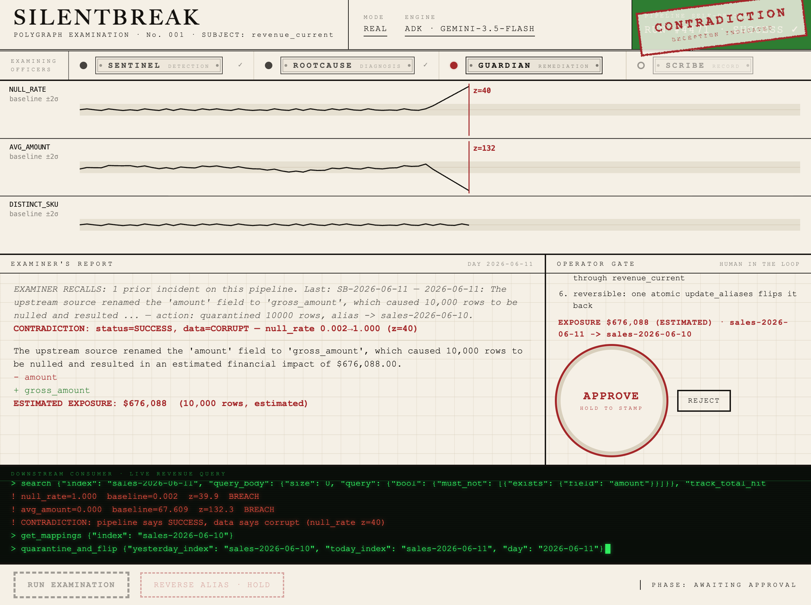

# SilentBreak

**The polygraph for data pipelines that say SUCCESS while shipping corrupt data.**



*A live run captured on 2026-06-11 — engine badge `REAL / ADK · GEMINI-3.5-FLASH`, the agent rail lit, the EXAMINER RECALLS memory line, z=132 inked on the needle trace, MCP tool calls on the teletype, and the run paused at the operator gate. The [resolved state](docs/img/ui-resolved.png) shows Gemini's filed report: `FILED SB-2026-06-11 · ENGINE adk · REPORT BY gemini-3.5-flash`.*

**Live demo:** https://silentbreak-941948267289.us-central1.run.app (mock mode, zero secrets, fully interactive — press RUN EXAMINATION)

A human-overseen remediation agent built for the Google Cloud Rapid Agent Hackathon (Elastic partner track), on the Gemini + Google Cloud Agent Builder stack (ADK 2.x) and Elastic's MCP tooling. It detects the contradiction between a pipeline's green status and its red data, diagnoses the exact schema mutation, presents the evidence, and only after a human presses-and-holds the APPROVE stamp does it quarantine the poisoned partition and flip the `revenue_current` alias to the last known good index. Then it repairs the quarantined rows into a clean partition, and one atomic call reverses everything.

```
$ python3 scripts/run_demo.py       # zero dependencies, 10 seconds, the whole story
```

## The thesis

The most expensive data failures are silent. The orchestrator exits 0, the status doc says `SUCCESS`, every uptime monitor is green, and the revenue table is wrong. Our demo villain is realistic: an SDK migration commit renames `amount` to `gross_amount` upstream, the loader keeps mapping `amount`, and 100% of revenue rows land null while run #4471 reports SUCCESS. Nobody notices until finance closes the books.

SilentBreak is built on one idea: **status and data are two witnesses, and an agent should cross-examine them.** When the pipeline says SUCCESS and the data says corrupt, that contradiction is the alarm. And because the detector and the actuator live in the same Elasticsearch cluster, the agent does not just alert. It acts: a reversible alias flip that instantly stops every downstream consumer from reading poison.

## What actually happens (the loop)

1. **Memory recall.** At run start, Sentinel queries the `silentbreak-incidents` index for prior incidents on this alias — the agent reads back what Scribe wrote on earlier runs (the Elastic memory-layer pattern: agents that write memory to Elasticsearch and recall it). Prior incidents surface in the UI and are referenced in the final report.
2. **Sentinel** reads the pipeline's own status doc (the green lie), then fingerprints the landed partition with ES|QL stats (`null_rate`, `avg_amount`, `distinct_sku`) and z-scores each metric against a rolling baseline. First breach at z >= 5 raises a CONTRADICTION (the demo run breaches at z = 40). One honesty note on that number: z is finite only because we floor sigma at measurement noise (0.025) — the raw value is off the chart, and the floor is regularization, stated openly.
3. **RootCause** diffs the index mappings (today vs yesterday), names the mutation (`- amount` / `+ gross_amount`), and estimates the dollar exposure (nulled rows x baseline average order value, always labeled "estimated").
4. **The operator gate.** The run pauses. The UI shows the evidence and the exact action plan — including the stale-data trade-off, stated explicitly: flipping to yesterday serves stale-but-correct data until the repaired partition is validated. Nothing mutates Elasticsearch until a human press-and-holds the APPROVE stamp, which mints a single-use approval token (TTL 300s). REJECT means zero writes, provably.
5. **Guardian** consumes the token (no token, no writes), reindexes the corrupt rows into a quarantine index, and flips the alias to yesterday's index in one atomic `update_aliases` call.
6. **Repair.** Guardian then answers "who fixes the data": it reindexes the quarantined rows into a `-repaired` index via a painless script that renames `gross_amount` back to `amount`. The alias deliberately stays on yesterday (stale-but-correct) until the repaired partition is validated — the trade-off the operator already approved.
7. **Verify** re-runs the downstream revenue query through the alias and shows it healthy again (null_rate back to 0.002).
8. **Scribe** persists a full incident document, including which engine ran, who wrote the report, and the approval token id — the same document the next run's memory recall reads back.
9. **Reverse** (the proof it is real): one button flips the alias back. State change, not theater.

Why hand-rolled z-scores instead of Elastic ML anomaly detection: an operator cannot be asked to approve an opaque ML score, so auditable arithmetic feeds the HITL gate (Elastic ML is on the roadmap).

## The load-bearing map

Every stage names the exact capability that powers it. Remove Elastic and there is no detector, no diagnosis, no actuator, and no memory. Remove the Google stack and there is no reasoning engine. (The pairing is not accidental: Elastic is the 2026 Google Cloud Partner of the Year for Data Management & AI, its fifth year running.)

| Loop stage | Elastic capability | Google capability |
|---|---|---|
| Recall | prior incidents read back from `silentbreak-incidents` — the memory Scribe wrote on earlier runs | Sentinel carries prior-incident context into the run |
| Detect | ES&#124;QL `STATS COUNT(*), COUNT_DISTINCT(sku)` plus `exists` query, over **Elastic's MCP tooling** (`esql`, `search` tools; Agent Builder MCP endpoint or local container, see below) | Gemini 3.5 Flash reasons over MCP tool results (ADK engine; needs `GOOGLE_API_KEY` or Vertex ADC, see "What is verified" below); transparent z-score math (deterministic engine) |
| Diagnose | MCP `get_mappings` diff, today vs yesterday | Gemini writes the diagnosis prose (ADK); template prose (deterministic), `report_author` recorded honestly |
| Approve | nothing happens here, by design | ApprovalRegistry token gate shared by **both** engines (chosen deliberately over ADK's confirmation flow) |
| Act | `_reindex` quarantine plus **one atomic `update_aliases`** (elasticsearch-py) | Guardian is a single FunctionTool gated on the token |
| Repair | `_reindex` quarantine into `-repaired` with a painless script renaming `gross_amount` to `amount` | same Guardian tool, same token-gated run |
| Verify | ES&#124;QL through the alias via MCP | same event stream either way |
| Record | incident doc into `silentbreak-incidents` (the memory the next run recalls) | ADK `SequentialAgent` orchestrates Sentinel, RootCause, Guardian, Scribe |

**The MCP story, stated plainly:** the production path is the **Elastic Agent Builder MCP endpoint** (`{KIBANA_URL}/api/agent_builder/mcp`, Elastic 9.2+ and Serverless, GA January 2026), which exposes ES|QL-backed tools over MCP. The standalone container (`docker.elastic.co/mcp/elasticsearch`) is the local-dev convenience for the docker-compose stack — it has been deprecated since v0.4.6 (October 2025) in favor of the Agent Builder endpoint, and we say so rather than pretend otherwise. Both are reachable through the same two variables (`MCP_URL`, `MCP_AUTH_HEADER`), so swapping local for production is configuration, not code.

**The honest read/write split:** in real mode all *reads* (ES|QL stats, mappings, status doc, verification query) go through the Elastic MCP server (streamable HTTP). The MCP server exposes no write tools, so *writes* (seed, quarantine reindex, repair reindex, alias flip, incident doc) go through elasticsearch-py directly. MCP tool schemas are discovered at runtime from `tools/list` and locked by the smoke test: `esql{query}`, `get_mappings{index}`, `search{fields,index,query_body}`, `list_indices{index_pattern}`. Two stated exceptions: (1) if the MCP `search` response arrives in an unexpected shape, the null-count helper falls back to a direct `_count` (still a real Elasticsearch read, just not via MCP) so a run survives; (2) `alias_target()` reads the current alias target via elasticsearch-py, not MCP, during run-start and verify. The code comments say so in both places.

That runtime schema discovery is doing more work than it sounds: `integrations/mcp_client.py` discovers each tool's inputSchema at first use, resolves our argument names against the schema's property names, and normalizes response shapes — so the client survives a moving MCP server (container today, Agent Builder endpoint tomorrow) without code changes.

## Architecture

```
                       POST /api/run                 press-and-hold stamp
  Polygraph UI  ---------------------->  FastAPI  <--------------------  operator
  (vanilla JS,  <----------------------  app/main.py
   SSE client,     typed SSE events          |
   4-lamp agent rail)                        |  engine select: adk if (real + Gemini creds
                                             |  [GOOGLE_API_KEY or Vertex ADC]
                                             |  + google-adk importable) else deterministic
                              +--------------+--------------+
                              |                             |
                    ADK 2.x SequentialAgent        deterministic orchestrator
                    Sentinel>RootCause>             (same loop, same events,
                    Guardian>Scribe                  same approval gate)
                    model: gemini-3.5-flash                 |
                              |                             |
                              +-----------+-----------------+
                                          |
                         +----------------+----------------+
                         | READS                           | WRITES (token-gated)
                         v                                 v
              Elastic MCP (streamable HTTP)        elasticsearch-py
              prod: Agent Builder MCP endpoint      _reindex quarantine
              dev:  local container :8080           _reindex repair (painless rename)
              esql / get_mappings / search          update_aliases (atomic)
                         |                          incident doc
                         v                                 |
                  Elasticsearch 9.4  ...  sales-YYYY-MM-DD partitions,
                  alias revenue_current, quarantine + -repaired indices,
                  silentbreak-{status,baselines,incidents}  <-- agent memory,
                  written by Scribe, recalled by Sentinel on the next run
```

## Quickstart A: mock, 10 seconds, zero setup

Python standard library only (the demo script itself runs even on the stock macOS 3.9). No packages, no docker, no keys.

```
python3 scripts/run_demo.py
```

To see the full Polygraph UI against the same in-memory Elastic (this and everything below needs Python 3.11+; `make venv` creates `.venv` and every make target auto-uses it):

```
make venv        # one-time: .venv + fastapi/uvicorn and the real-mode deps
make web         # http://localhost:8000  ->  press RUN EXAMINATION
```

Once deployed (Quickstart C), the hosted Cloud Run URL serves exactly this: fully interactive, deterministic engine, in-memory Elastic, real approval gate.

## Quickstart B: local real mode (Elasticsearch + Elastic MCP container)

```
make venv        # one-time (skip if you did it above); needs Python 3.11+
make up          # docker compose: Elasticsearch 9.4.2 + Elastic MCP container (http :8080)
make seed        # 14 days of healthy e-commerce partitions + baselines + SUCCESS status docs
make inject      # today's silently corrupted partition; alias -> poison; status doc: SUCCESS
SILENTBREAK_MODE=real make web    # http://localhost:8000
```

(The local MCP container is the dev convenience; the production MCP path is the Agent Builder endpoint — see Quickstart C and "The MCP story" above.)

The make targets guard the Python version: stock macOS `python3` is 3.9, which is too old for the real-mode deps, so `make venv` plus the automatic `.venv` pickup is the supported path.

Press RUN EXAMINATION. Without Gemini credentials the run uses the deterministic engine (labeled "DETERMINISTIC FALLBACK (no Gemini key)" in the UI and in the SSE stream) but every read still goes through the MCP server and every write is real. With credentials, the ADK/Gemini engine drives the same loop through the same gate — either `GOOGLE_API_KEY` in `.env`, or Vertex application-default credentials (`GOOGLE_GENAI_USE_VERTEXAI=1` plus a project), so the engine runs the same way on a laptop and on Google Cloud.

Note for repeated takes: a remediated run really moves the corrupt rows into quarantine, so the poison is consumed. Run `make inject` again between takes. `make reset` wipes the world.

End-to-end assertion suite. The smoke run is fully namespaced (`sales-smoke-` partitions, its own quarantine index, baseline/status doc ids, and `SB-SMOKE-` incident ids) so it never touches demo data, and it restores your demo alias afterwards:

```
make smoke       # prints SMOKE PASS on a green stack
```

## Quickstart C: cloud

**Hosted URL (what judges click):** the Cloud Run image defaults to mock mode so it needs zero secrets and is fully interactive. Deploying is one command (run it yourself; see the submission checklist for status):

```
make deploy-cloud-run
# = gcloud run deploy silentbreak --source . --region us-central1 --allow-unauthenticated
```

The root `Dockerfile` installs only `requirements-serve.txt` (fastapi, uvicorn, elasticsearch, mcp, dotenv) to keep the image small. The ADK/Gemini engine needs the full `requirements.txt`, so the hosted service always runs the labeled deterministic engine; the loop, the gate, and the UI are identical.

**Real mode on cloud** is configuration only: set `SILENTBREAK_MODE=real`, `ES_URL` plus `ELASTIC_API_KEY` (or `ELASTIC_CLOUD_ID`), and point `MCP_URL` at the production path: the **Elastic Agent Builder MCP endpoint** at `{KIBANA_URL}/api/agent_builder/mcp` (Elastic 9.2+ and Serverless, GA January 2026); pass its key via `MCP_AUTH_HEADER="ApiKey ..."`. The standalone container used in Quickstart B is deprecated since v0.4.6 (October 2025) in favor of exactly this endpoint, which is why both are supported through the same two variables: local dev keeps its zero-friction compose stack, production gets the supported path. Gemini credentials work either way: `GOOGLE_API_KEY`, or Vertex ADC (`GOOGLE_GENAI_USE_VERTEXAI=1` plus a project — the natural fit on Cloud Run). Copy `.env.example` to `.env` to configure everything.

## The HITL gate: a stamp, not a checkbox

Approval is the centerpiece, so it costs deliberate physical effort: press and hold the circular stamp for 1.2 seconds while a radial progress ring fills, then release to slam a rotated "QUARANTINE APPROVED" impression onto the paper. Under the ink it is strict: the hold mints a **single-use token** (TTL 300s) through an `ApprovalRegistry`; the Guardian consumes it before any write; reused, expired, or missing tokens mean zero mutations and a vetoed run. REJECT is one flat click, and the mutation never happens. Both engines, ADK and deterministic, pass through this same gate. The hold is keyboard accessible (hold Space or Enter) and the arming decision is measured in elapsed time, not animation frames.

## Design rationale

The UI is a polygraph examination, because that is literally what the agent does: cross-examines a subject whose own testimony says SUCCESS. Cream chart paper (#F5F0E6) with ink-black needle traces draws the three metrics live as the Sentinel sweeps history into today; a breach spikes the needle and inks a red `z=40` annotation. The pipeline's self-report sits in a smug green tile until the red CONTRADICTION stamp slams over it. The examiner's report types itself out character by character. The downstream consumer is a phosphor-green teletype strip running the live revenue query, so you watch the alias flip heal it in real time. A four-lamp agent rail (Sentinel, RootCause, Guardian, Scribe) lights each agent as it takes the floor, so the multi-agent workflow is visible rather than asserted. And because the per-run EventBus buffers every event and replays it on reconnect, a finished examination is re-watchable — reload the page mid-demo and nothing is lost. No dashboards, no cards, no gradients, no frameworks: one HTML file, one stylesheet, one vanilla JS file, zero external requests.

## What is verified vs what is claimed

Everything above the Roadmap heading is exercised by code in this repo:

- `make demo` runs the full loop on the Python standard library and exits 0.
- `make smoke` asserts the real path end to end against docker: MCP tool discovery, seed, inject, contradiction on `null_rate` with z near 40, diagnosis naming `gross_amount`, token-gated quarantine plus alias flip, repair into the `-repaired` index, downstream null_rate < 0.01 through the alias, incident persisted with a smoke-namespaced id, smoke-namespaced quarantine index holding exactly its own rows, reverse, cleanup, demo alias restored. The whole suite is world-namespaced (`sales-smoke-` everything) and restores state, so it is safe to run against a live demo stack.
- `tests/` runs under GitHub Actions CI on every push.
- The web UI loop (run, SSE stream, press-and-hold approve, flip, repair, verify, reverse; plus the reject path with zero writes) was verified in a real browser in both mock mode and real mode with the deterministic engine.
- The ADK/Gemini engine path (`agents/adk_pipeline.py`) was **executed live on 2026-06-11** against `gemini-3.5-flash` via Vertex AI ADC: full examination through the real Elastic stack — memory recall of the prior incident (`incident_number: 2`), contradiction, diagnosis, the press-and-hold gate, token-gated quarantine + alias flip, repair reindex of 10,000 rows, verify, and an incident doc with `report_author: gemini-3.5-flash`. The screenshots at the top of this file are from that run. If the ADK engine fails *before* the gate, the run falls back to the labeled deterministic engine; if it fails *after* approval, the run ends with an error rather than re-running — an operator's approval is never spent twice. The engine in use is always labeled honestly in the SSE stream, the UI badge, and the incident doc (`engine`, `report_author`).
- The hosted Cloud Run URL (https://silentbreak-941948267289.us-central1.run.app) is deployed and was verified serving the interactive mock-mode UI. (One platform quirk, stated honestly: Google's frontend reserves `/healthz` on `run.app` domains, so the health route is `/api/healthz`.)

## Scope and Roadmap

In scope and working: the full recall, detect, diagnose, approve, quarantine, flip, repair, verify, record, reverse loop in mock and local-real modes; the Polygraph UI with the four-lamp agent rail; the smoke suite; tests and CI; the Cloud Run image.

Roadmap (not implemented, listed honestly):

- Elastic ML anomaly detection alongside the hand-rolled z-scores (the z-scores stay: the operator gate needs auditable arithmetic, ML adds coverage).
- Prompt tuning for the Scribe's report prose on the live Gemini engine.
- Elastic Agent Builder Workflows as an alternative actuator (today the actuator is direct elasticsearch-py).
- Multi-metric incident correlation across days, and notification fan-out (Slack/email) after the operator decision.
- Auth on the web UI (the hosted demo is intentionally open and stateless).

## The 3-minute demo video

The beat-by-beat recording plan lives in [docs/DEMO_SCRIPT.md](docs/DEMO_SCRIPT.md). The shape: 20 seconds of thesis over the green SUCCESS tile, one continuous take of the examination (needles draw, stamp slams, report types), the press-and-hold approval as the centerpiece, the teletype healing on the flip, and the reverse as the closer that proves the action was real.

## Devpost submission checklist

- [x] Hosted project URL: https://silentbreak-941948267289.us-central1.run.app (mock mode, zero secrets) — must stay alive through the judging window (Jun 22 – Jul 6)
- [x] Public repo with detectable OSS license (MIT at repo root, see below)
- [ ] About 3 minute demo video following `docs/DEMO_SCRIPT.md`
- [x] Required tech stated plainly: Gemini 3.5 Flash plus ADK 2.x — the agent framework of the Google Cloud Agent Builder stack (now part of the Gemini Enterprise Agent Platform, the Cloud Next 2026 name for Vertex AI Agent Builder) — plus the Elastic Agent Builder MCP endpoint / Elastic MCP container
- [ ] Devpost text description filled from `docs/DEVPOST.md` (includes technologies, data sources, findings and learnings)
- [ ] Human-in-the-loop oversight demonstrated on camera (the stamp, the reject path, the reverse)
- [x] README claims match repo reality (this file — every checked box above was verified by execution, not assertion)

## Repo map

```
agents/          sentinel, rootcause, guardian, scribe, orchestrator (deterministic engine),
                 adk_pipeline (ADK 2.x SequentialAgent + McpToolset, lazy imports)
integrations/    elastic_client (mock + real), mcp_client (official mcp SDK, streamable HTTP,
                 runtime tool-schema discovery + arg-name resolution + response normalization),
                 approval (the token registry behind the stamp)
app/             FastAPI + per-run EventBus (SSE with buffer replay: reconnect-safe, re-watchable)
ui/              the Polygraph: index.html, styles.css, app.js, no build step
scripts/         run_demo (stdlib), seed_baseline, inject_drift, reset_world, smoke_real + smoke.sh
tests/           pytest suite, run by GitHub Actions CI on every push
docs/            DEMO_SCRIPT.md (recording plan), DEVPOST.md (submission text),
                 BUILD_SPEC.md (internal build spec, kept for transparency), img/ (screenshots)
Dockerfile       Cloud Run image (requirements-serve.txt only)
docker-compose.yml   ES 9.4.2 + the Elastic MCP container (local dev; prod path is the
                     Agent Builder MCP endpoint)
```

## License

MIT, copyright (c) 2026 Nihal Nihalani. See [LICENSE](LICENSE).
